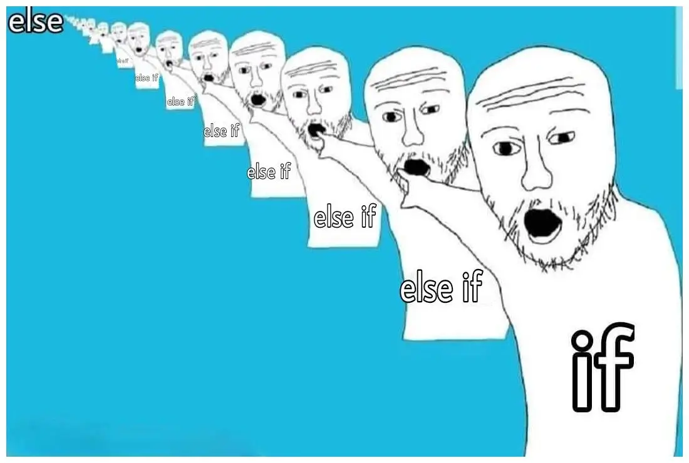

# Clean Code Cheatsheet


Bedingungen, dessen Variablen einen boolschen Wert zurückgeben, kann man bei der Überprüfung so kürzen, dass nur die boolsche Variable genügt.

### Überprüfung auf true: 
```java
boolean istGültig;
// ...
if (istGültig) {
    // ..
}
```

### Überprüfung auf false: 
```java
boolean istGültig;
// ...
if (!istGültig) {
    // ..
}
```


Java und viele andere Programmiersprachen wie z.B. JavaScript haben den sogenannten Ternary Operator eingebaut.

Mit ihm lassen sich Bedingungen, die sich eigentlich über mehrere Zeilen erstrecken würden, in einer einzigen Zeile zusammenfassen.



Manchmal sollte man Leichtigkeit nicht über Lesbarkeit stellen.

## Guard Close Pattern

### Ohne Pattern


### Mit Pattern


<br />


## DON'T TO THIS:
```java
public class beispiel-Klasse {

}
```
## DO THIS:
```java
public class BeispielKlasse {

}
```

## DON'T TO THIS:
```java
String summe_summe;
```
## DO THIS:
```java
String summeSumme;
```